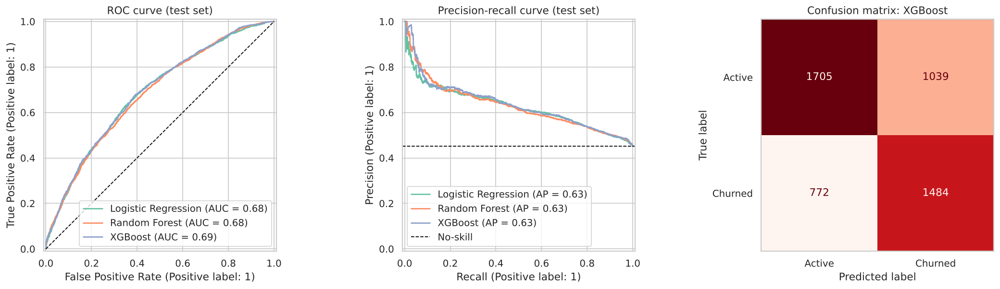
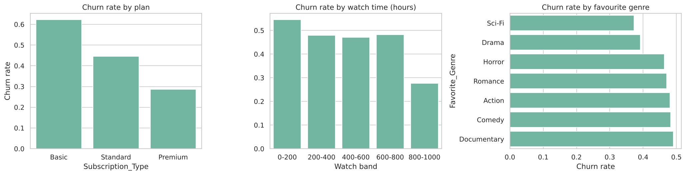

# Netflix Customer Churn Prediction

Predicting which streaming subscribers will cancel, built with **Python, scikit-learn and XGBoost**. Version 2 of this project focuses on doing the modelling properly: diagnosing a misleading first model, then rebuilding with baselines, stratified cross-validation, class weighting and threshold tuning.



## Results (held-out test set, 5,000 customers)

| Model | ROC-AUC | PR-AUC | F1 | Balanced accuracy |
|---|---|---|---|---|
| Majority-class baseline | 0.500 | 0.451 | 0.000 | 0.500 |
| Logistic Regression | 0.683 | 0.626 | 0.614 | 0.639 |
| Random Forest | 0.680 | 0.629 | 0.608 | 0.628 |
| **XGBoost** | **0.686** | **0.634** | **0.621** | **0.640** |

With the decision threshold tuned to **0.35** (chosen on cross-validated training predictions), XGBoost catches **87% of churners** (recall 0.867, precision 0.516, F1 0.647). That trade-off suits a retention campaign, where missing a churner costs more than contacting a loyal customer.

## What drives churn



| Driver | Finding |
|---|---|
| **Subscription plan** (strongest) | Basic 62% churn · Standard 45% · Premium 29%. Basic users churn about twice as often as Premium. |
| **Watch time** | Light viewers (0–200 h) churn most (55%). Very heavy viewers (800 h+) churn least (28%). |
| **Favourite genre** | Sci-Fi and Drama fans churn least (about 37–39%). Documentary, Comedy and Action fans churn most (about 48–49%). |
| Age, country | Little to no effect |

**Retention ideas:** upgrade offers for Basic-plan customers, personalised recommendations to re-engage light viewers, and content gap analysis for higher-churn genres.

## Lessons from version 1

The first version reported **100% recall** and 73.7% accuracy with Logistic Regression. On inspection:

- Churn was defined as *no login for 500+ days*, which depends **only on the last login date**. Every customer who last logged in before 6 Dec 2024 was "churned" (74% of customers).
- The customer features had **no signal** for that label (ROC-AUC ≈ 0.50 for every model), so the model simply predicted "churn" for everyone.

Version 2 shows this diagnosis in the notebook and switches to metrics that cannot be gamed by predicting one class (ROC-AUC, PR-AUC, F1, balanced accuracy), always compared against a majority-class baseline.

## Data

- 25,000 synthetic customers of a streaming service (March 2024 – March 2025)
- Features: age, country, subscription type, watch time (hours), favourite genre
- Target: `Churn` from `netflix_data_realistic_churn.csv`, a **simulated** label with 45% churn that depends on plan, viewing behaviour and genre
- `User_ID`, `Name` and `Last_Login` are excluded from modelling

Because the data is synthetic, absolute scores won't transfer to a real service. The value of the project is the workflow.

## Approach

1. EDA of churn by plan, watch time, genre, age and country
2. Stratified 80/20 train/test split
3. Preprocessing pipeline: one-hot encoding for categorical features, scaling for numeric features
4. Models: majority baseline, Logistic Regression, Random Forest, XGBoost, with class weighting for imbalance
5. 5-fold stratified cross-validation for model selection; single final evaluation on the test set
6. Threshold tuning for F1, and permutation importance for explainability

## Project structure

```
data/raw/                          Raw and labelled datasets
notebooks/01_netflix_eda.ipynb     Version 1: EDA and first model
notebooks/02_churn_modeling.ipynb  Version 2: diagnosis, modelling, evaluation
models/churn_model.joblib          Final XGBoost pipeline + tuned threshold
reports/test_metrics.csv           Test-set metrics for all models
reports/model_card.md              Model card
reports/plots/                     Charts
```

## How to run

```bash
pip install -r requirements.txt
jupyter notebook notebooks/02_churn_modeling.ipynb
```

```python
import joblib, pandas as pd
m = joblib.load('models/churn_model.joblib')
X = pd.DataFrame([{'Age': 34, 'Country': 'Germany', 'Subscription_Type': 'Basic',
                   'Watch_Time_Hours': 120, 'Favorite_Genre': 'Comedy'}])
p = m['pipeline'].predict_proba(X)[:, 1]
print(p, p >= m['threshold'])
```

## Author

**Muhammad Usman Khan** · [Portfolio](https://data-meta.github.io) · [LinkedIn](https://www.linkedin.com/in/muhammad-usman-khan-data-analyst/) · [GitHub](https://github.com/DATA-Meta)
